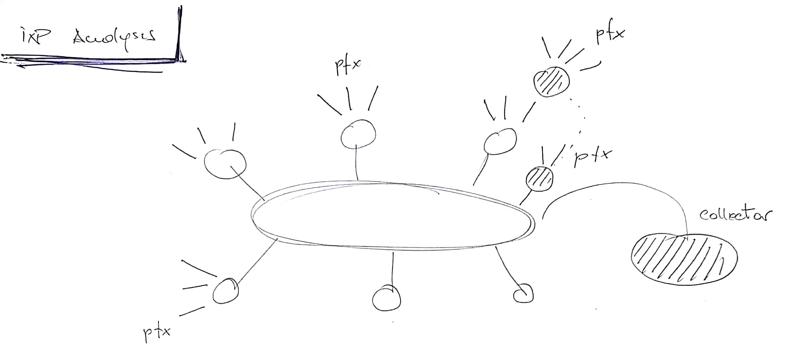
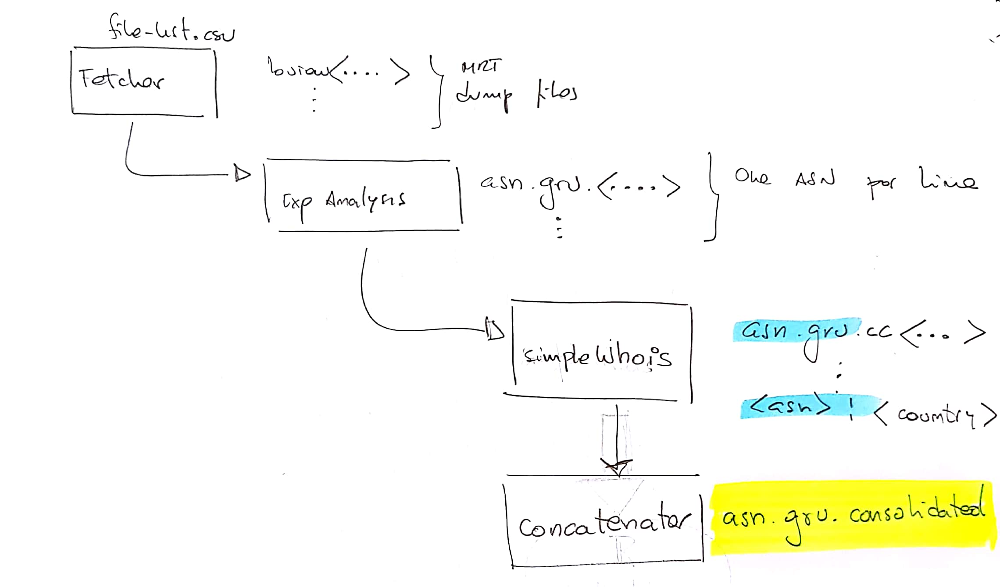

```{r setup, include=FALSE}
knitr::opts_chunk$set(echo = FALSE)
library(webshot)
library(dplyr)
source('ix.br.sp-analysis-v1.R')
```

## Analisis de ASNs en IX.BR Sao Paulo (v2)

**Version 2**

## Objetivo y definiciones

Presentar una evolución histórica de la presencia de ASNs no locales en algunos IXPs de la región LATAM.

Definimos como AS "no local" a un AS cuyo código de país de registro no coincide con el país de registro del AS del IXP mismo.

**Foco inicial : PTT Metro Sao Paulo**

- Hay un sensor de RIS localizdo dentro del PTT
- Es el IXP más grande de la región
- Existe evidencia anecdótica de que está atrayendo miembros del exterior

## Fuentes de información

Evaluamos las siguientes fuentes de información:

- Información histórica de tablas de enrutamiento en IXPs
    - RIPE RIS
    - RouteViews
    - PCH LookingGlass
    
- Información de registro
    - "delegated-extended" de LACNIC
        - http://ftp.lacnic.net/pub/stats/lacnic/

El análisis principal se realizó utilizando las tablas completas recolectadas por RIS, en particular por el colector localizado en el PTT de Sao Paulo (rrc15.ris.ripe.net). 

## Metodología y definiciones

**ASes "participantes"** *Analizamos la tabla de enrutamiento vista por rrc15 y tomamos como participantes los sistemas autónomos que:

- aparecen en primer o segundo lugar en el AS_PATH de cada prefijo 
    - *Esto es necesario debido a que rrc15 (el colector de rutas) no tiene peering completo con todos los miembros del IXP*
- aportan al menos 25 paths al IXP
    - *Necesario para filtrar contribuyentes muy menores con bajo grado de conectividad*

## Metodología y definiciones (ii)

```{r, out.width = "80%"}

```

## Herramientas de procesamiento

- CAIDA BGPStream
    - Lectura de archivos MRT (formato de volcado de tablas usado por RIS)
    - https://bgpstream.caida.org/docs/tools/bgpreader

- Python 
    - ipaddr: _Manipulación de direcciones IP_
    - consecution: _Pipeline de procesamiento de datos_
    
## Pipeline de procesamiento de datos

```{r, out.width = "80%"}

```

## Evolución de contribuyentes al IXP

```{r, out.width="80%"}
gr1()
```
    
## Algunas gráficas (1)

*Country Codes no BR en el IXP de Sao Paulo (2011)*

```{r  message=FALSE, warning=FALSE}
#g
plot_ly(g$data, type="bar", x=~Var1, y=~Freq)
```

## Algunas gráficas (1A)

*Country Codes no BR en el IXP de Sao Paulo (2011)*

```{r}
plot_ly(g$data, labels = ~Var1, values=~Freq, type="pie", textposition='outside', textinfo='label+percent')
```

## Algunas gráficas (2)

*Country Codes no BR en el IXP de Sao Paulo (2018)*
```{r message=FALSE, warning=FALSE}
#source('ix.br.sp-analysis-v1.R')
#h
plot_ly(h$data, type="bar", x=~Var1, y=~Freq)
```

## Algunas gráficas (2A)

*Country Codes no BR en el IXP de Sao Paulo (2018)*

```{r message=FALSE, warning=FALSE}
plot_ly(h$data, labels = ~Var1, values=~Freq, type="pie", textposition='outside', textinfo='label+percent')
```

## Algunas gráficas (2B)

*Top 10 Country Codes no BR en el IXP de Sao Paulo (2018)*

```{r message=FALSE, warning=FALSE}
d = top_n(h$data, 12)
plot_ly(d, labels = ~Var1, values=~Freq, type="pie", textposition='outside', textinfo='label+percent')
```

## Lineas útiles: Procesamiento de un archivo usando bgpstream

```{r, eval=FALSE, engine='bash', echo=TRUE, tidy=TRUE, out.width="80%"}
time bgpreader -w $(date +%s --date='Mar 16, 2017 0:00utc'),1489795200 \
     -d singlefile -p ris -o rib-file,data/ris/bview.20170317.1600.gz \
     -k 200.40.0.0/18 | ./ixpAnalysis.py

time bgpreader -w $(date +%s --date='Mar 17, 2011 0:00utc'),1489795200 \
     -d singlefile -p ris -o rib-file,data/ris/bview.20110317.1559.gz \
     -k 200.40.0.0/18 | ./ixpAnalysis.py

time bgpreader -w $(date +%s --date='Mar 17, 2011 0:00utc'),1489795200 \
     -d singlefile -p ris -o rib-file,data/ris/bview.20110317.1559.gz \
     -k 200.40.0.0/18 | ./ixpAnalysis.py
```

## Lineas útiles: Agregando código de país

```{r, eval=FALSE, engine='bash', echo=TRUE, tidy=FALSE, out.width='80%'}
./simplewhois.py bulk_query \
   --outfile=data/asn.gru.cc.20110317.csv \
   < data/asn.gru.20110317.csv 
```

## Lineas útiles: Bajando los archivos de RIS

```{r, eval=FALSE, engine='bash', echo=TRUE, tidy=FALSE}
cd data/ris
cat ../../source_files.csv \
   | awk -F\| '{print $3}' \
   | xargs -iF wget -c F
```

## Consecution Pipeline

```{r, eval=FALSE, engine='python', echo=TRUE, tidy=FALSE}
# Define pipeline
pipe = Pipeline( 
    risFetcher('ris_file_fetcher') | 
    tableAnalysisNode('table_analysis') | 
    simpleWhoisNode('add_cc_data' ) |
    concatenator('concatenator')
)
```

## Consecution Node

```{r, eval=FALSE, engine='python', echo=TRUE, tidy=FALSE, out.width="80%"}
class tableAnalysisNode(Node):
    #
    def process(self, item):
        print('{: >15} processing {}'.format(self.name, item))  
        scr_tpl = """
        bgpreader -w $(date +%s --date='Mar 16, 2010 0:00utc'),\
             $(date +%s --date='Mar 16, 2018 0:00utc') \
            -d singlefile -p ris -o rib-file,data/ris/{ifile} {filters} | \
            ./ixpAnalysis.py --outfile=data/{ofile} --criterion=3
        """
        filters = ""
        a = urlparse.urlparse(item[2])
        ifile = os.path.basename(a.path)
        ofile = "asn.gru.{date}.csv".format(date=item[0])
        scr = scr_tpl.format(ifile=ifile, ofile=ofile, filters=filters)
        os.system(scr)
        #
        self.push([item[0], ofile])
```

## ¡Gracias!

```
¿Preguntas?
```
